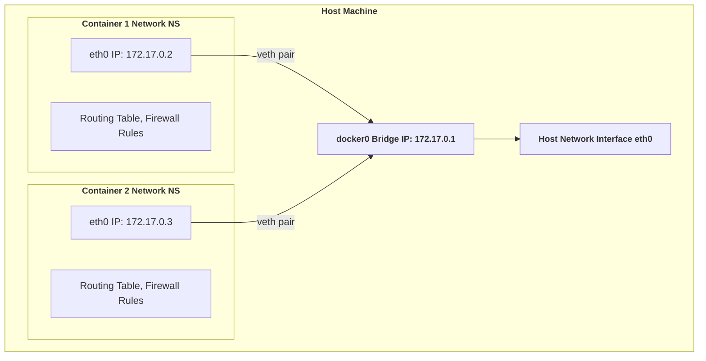
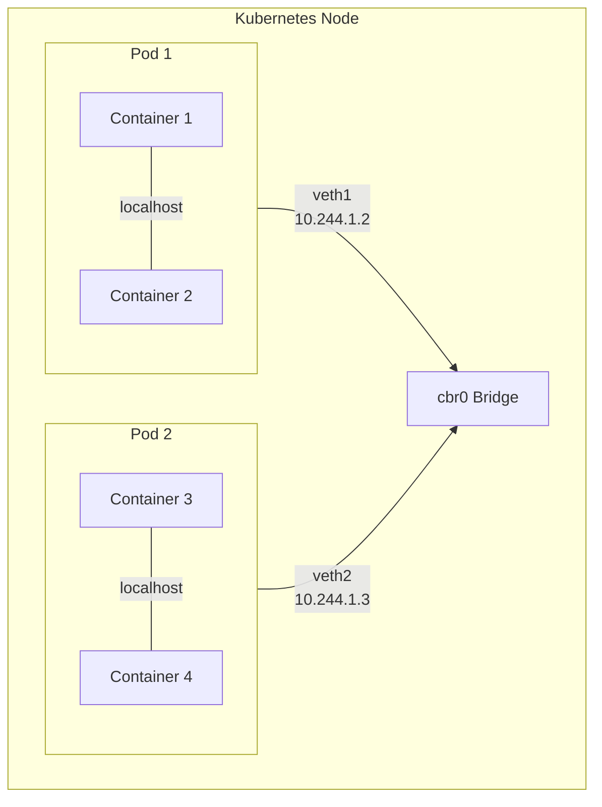

In this Article we will be talking about how networking works in kubernetes by going to very basic to very high level.
## **Container Network**:
When we create a container using Docker (or any other container runtime like CRI-O), it automatically generates a separate Linux network namespace for that container. This means that the container gets its own network stack, including its own IP address, routing tables, and ports, which are isolated from the host machine's network.
### Why Separate Network Namespaces?
To understand the importance of network namespaces, let's first look at what happens when we don't use them.
#### Host Network Mode:
When Docker is configured to use the host network for a container (by specifying `--net=host`), it does not create a separate network namespace for that container. 
Instead, the container shares the host’s network namespace, giving it direct access to the host’s network interfaces and IP addresses. This means the container runs as if it is part of the host’s network stack, without a unique network layer or isolated IP.
```bash
docker run -d --net=host --name nginx-host nginx
```
the above command runs the NGINX container and binds it directly to the host's network. Instead of having its own isolated network namespace, the container will use the host’s IP address and network interfaces.****

Advantage of using `--net=host` :
- This will enable the container to directly listens to port 80 (or whatever port needed) of the host. this will eliminate the use of Docker port publishing
- Directly using the host network stack will provide better network performance for the container.
- Simplified debugging of network issues.

Disadvantages of Using `--net=host`:
- Have multiple container on the same node will introduce problems with shared network resources like port conflicts etc.
- It will not isolate the network of the container from the Host network 
- Due to no network isolation the containers are more vulnerable if the host network is attacked or compromised.
- Potential interference with host network services
### Benefits of Network Namespaces
In the above scenario, using `--net=host` should be approached cautiously, especially for production environments where isolation and security are critical.
To avoid these problems, it’s recommended to keep containers in their own separate **network namespaces**, which include separate IP addresses and port allocations. This brings several benefits:
- **Network Isolation**: Each container can run independently with its own network stack, avoiding conflicts and maintaining security boundaries. This isolation also ensures that processes in one container cannot directly interfere with or spy on network traffic in another container or the host.
- **Flexibility**: Containers with their own network namespaces can be flexibly attached to different networks or virtual networks, such as bridges or overlay networks, which can be used to provide dynamic networking configurations 
- **Resource Management**: Having containers in separate network namespaces makes it easier to manage network resources. Different CNI plugins in kubernetes (e.g., Calico, Cilium) uses custom network policies to enforce fine-grained networking policies, allowing for better control over container communication.
- **Host Network Protection**: By isolating the container’s network stack from the host’s, it reduces the risk of accidental or malicious misconfiguration impacting the host’s networking.
## **Pod-to-Pod Communication :**
In this section, we will explore how **Kubernetes pods** communicate with each other, whether they are on the same node, different nodes, or even across clusters. But before we dive into pod communication, it is essential to understand how pods within nodes communicate between each other.
### Same-Node Communication
### Container and Network Namespaces
- Every Pods, by design, runs within its own **network namespace** which provides an isolated network stack, similar to a host with an independent "network stack" containing a unique IP address, routing tables, and ports. The question is: how do containers in separate network namespaces communicate with each other?
### Communicating within same host:
- When we are deploy or run pods (in Docker or Kubernetes), they may need to talk to each other, right? But how does that work?
- Well, every time a new container or pod is created, Docker or any other Container Runtime Interface (CRI) establishes a **separate network namespace** for it which ensures network isolation. Essentially, a network namespace provides a container with the illusion of being a separate machine, allowing it to communicate independently.
- Since the pods are now  in separate Network Namespaces which isolated pod network the host, the **Container Network Interface (CNI)** or Docker sets up **Ethernet devices** within the pods to handle communication. These Ethernet devices are part of what we call **Veth Pairs**.
- **Veth Pairs (Virtual Ethernet Devices)**: pods are connected to the bridge using **veth pairs** (virtual ethernet pairs). 
	- When a pod is launched or created, Docker or the CNI creates two virtual Ethernet devices (called veth pairs). One side of the veth device is placed inside the container’s network namespace, while the other end connects to the host’s network namespace or a virtual bridge.
	- Any data packet sent from one side of the veth device is immediately transferred to the other side. This is how containers communicate over the bridge.
	- To view Veth pair
	```bash
	# View veth pairs on host
	ip -c link show type veth
	
	```
- **Virtual Bridge**: When Docker is installed, or a host joins a Kubernetes cluster, a virtual bridge (called `docker0` in Docker) is created on a host, which acts like a **virtual switch**. Every pod is connected to this bridge, and through it, they can communicate with one another.
	- The pods are assigned unique IP addresses by the bridge for communication.
	- We can use this command `brctl show` to show the bridges.
	- Additionally, to check the virtual network interfaces on a node, we can use `ifconfig` or `ip address`.
	To view virtual bridge
	```
	# View bridge details
	bridge link show
	brctl show
	
	#Examine bridge interface
	ip addr show cbr0
	```
- useful commands for network debugging
```bash
lsns -t net          # List network namespaces
brctl show           # Show virtual bridges
ip addr              # Show network interfaces
```
- **Example packet flow**:
	-  Pod A (10.244.1.2) → Pod B (10.244.1.3) on same node suppose we ping from pod A to pod B:
		1. Packet leaves Pod A's network namespace via veth
		2. Enters host network namespace
		3. Processed by bridge (cbr0/docker0)
		4. Forwarded to Pod B's veth
		5. Enters Pod B's network namespace
- FlowChart for internal connection:

### Communicating within same host in Kubernetes:
While Docker uses `docker0`, Kubernetes abstracts container communication using its own networking model. 
**Kubelet**, the Kubernetes node agent, creates a network namespace for each pod and attaches the pod to the network through the **Container Network Interface (CNI)** plugins.
- Each Pod in a Kubernetes cluster has its own independent IP address whereas in docker.
-  Multiple Pods on same host can directly communicate with each other using localhost or Pod IP addresses because their Network Namespace is connect to same bridge.
- `cbr0`(L2 network device) is own kubernetes bridge which is created to differentiate from `docker0` bridge used by docker.


>Tl;DR
>Each pod runs in its own **network namespace** . On the host, A virtual bridge (e.g., `docker0`, `cbr0`) is established, that allowing communication between containers attached to this bridge. **Veth pairs**  link each container to the bridge, facilitating packet transmission between containers via this virtual switch.
### Cross-Host Communication:
So far, we have discussed how pods communicate within the same host using bridges like `docker0`. However, in a Kubernetes cluster, pods are distributed across multiple nodes, and they still need to communicate seamlessly. Let's understand how Kubernetes achieves this cross-node communication.

- On a single node, communication is relatively simple due to the presence of a **virtual bridge** (`docker0`). However, **`docker0` bridges on different nodes are isolated** and do not automatically have connections between them.
- **Overlay Network: A Solution for Cross-Node Communication**:
	- An overlay network provides a virtual network that connects containers across multiple nodes. Essentially, it creates a **"public" bridge** using software, which spans across all the nodes in the cluster.
	- Through this network, containers or pods can communicate as if they were on the same physical or virtual LAN, even if they are located on different nodes.
	- Basically Overlay Network is a flat network working above host network.
	- Kubernetes does not provide any default network implementation, rather it only defines the model and leaves to other tools like kube-proxy, Calico, Flannel to implement it
	- Packet flow from pod A in node1 to podB in node2
	```mermaid
	graph LR
	A[Pod A - Node 1] --> B[veth pair -Node 1]
	B --> C[Bridge cbr0 - Node 1]
	C --> D[Overlay Network]
	D --> E[Bridge cbr0 - Node 2]
	E --> F[veth pair -Node 2]
	F --> G[Pod B - Node 2]
	```
	- Flowchart for the same
	```mermaid
	%% Cross-Node Pod Communication
	flowchart TB
	    subgraph Node1["Node 1"]
	        subgraph P1["Pod 1 (10.244.1.2)"]
	            C1["Container"]
	        end
	        B1["cbr0 Bridge"]
	        F1["flannel0/calico"]
	        P1 --> |veth| B1
	        B1 --> F1
	    end
	    
	    subgraph Node2["Node 2"]
	        subgraph P2["Pod 2 (10.244.2.2)"]
	            C2["Container"]
	        end
	        B2["cbr0 Bridge"]
	        F2["flannel0/calico"]
	        P2 --> |veth| B2
	        B2 --> F2
	    end
	    
	    subgraph Overlay["Overlay Network"]
	        direction LR
	        RT1["Router/Switch"]
	    end
	    
	    F1 --> |"VXLAN/\nIPIP"| RT1
	    F2 --> |"VXLAN/\nIPIP"| RT1
	    
	```
>[!note]
> All plug-ins must follow a couple of important rules. 
> First, Pod IP addresses should come from a single pool of IP addresses, although this pool can be subdivided by node. This means that we can treat all Pods as part of a **single flat network**, no matter where the Pods run.
> Second, traffic should be **routable** such that all Pods can see all other Pods and the control plane.

- **How CNI Work**:
	- Overlay networks in Kubernetes are primarily managed by specific CNI (Container Network Interface) plugins. CNIs are responsible for two crucial tasks:
		-  **IP Management**: CNIs allocate and manage each Pod's IP address, ensuring that there are no conflicts within the network.
		-  **Data Synchronization**: CNIs synchronize network information across all nodes to maintain consistent routing and communication between nodes.
	- Overlay networks are built using tunneling techniques such as **VXLAN (Virtual Extensible LAN)**, **GRE (Generic Routing Encapsulation)**, or other protocols. These tunnels allow data packets to be encapsulated and transported between nodes in the cluster.
		
	To understand how CNI works lets take a look on how flannel works 
	-  **Flannel** operate at Layer 3 of the OSI model, focusing on IP-based routing for communication between nodes:
	 **Flannel:** 
	- Flannel is created by CoreOS for Kubernetes networking, It support in 3 different models:
		#### Mode 1: UDP
		- When Flannel is set up on a Kubernetes node, it runs a daemon named **flanneld**. This daemon creates the TUN device `flannel0`, which acts as the default gateway for the Docker bridge (`docker0`).
		- Flannel allocates a unique subnet from the Pod CIDR to each node, ensuring that every Pod on that node receives an IP within this subnet.
		- Flanneld will query the local cache or etcd based on the private IP address of the receiver. It will get the IP address of the receiver host then route the packet to the required host.
		- To view the private network segment allocated to Docker, we can check `/etc/docker/daemon.json` on the node. Flannel can also modify Docker's configuration to attach the allocated network segment by using the `--bip` option.
		- Suppose we have pod0 on node1 and pod1 on node2 then the Packet flow would be:
			- **Pod0** → `docker0` → `flannel0` (flanneld packs the packet) → (sender network interface) → (intermediate router) → (receiver network interface) → `flannel0` (flanneld unpacks) → `docker0` → **Pod1**
		- As we can see **The process is very complicated and long.** And as flanneld runs in userspace there is a performance cost due to context switching and packet handling.
		#### Mode 2: VxLan
		- VXLAN, or Virtual Extensible LAN is a network virtualization technology supported by Linux. 
		- VXLAN can completely implement encapsulation and decapsulation in kernel mode, thereby building an overlay network through the "tunnel" mechanism.
		- In this mode, the previous IP allocation remains unchanged (flannel0 is changed to flannel.1), and a VXLAN tunnel needs to be established between the sending host and the receiving host, that is, a VTEP(VTEP works on layer2)
		- **The process is still very long, but because the packing and unpacking operations are performed by the kernel, the efficiency is higher than UDP.**
		- To view VXLAN interfaces `ip -d link show type vxlan` and for monitoring we can use tcpdump
		- Here is the flow diagram for VxLan mode:
		```mermaid
		sequenceDiagram
		
		participant P1 as Pod 1
		
		participant D1 as docker0
		
		participant F1 as flannel.1 (VTEP)
		
		participant NET as Physical Network
		
		participant D2 as Target docker0
		
		Note over F1: VXLAN Encapsulation (Kernel Space)
		
		P1->>D1: 1. Send packet
		
		D1->>F1: 2. Forward to flannel.1
		
		Note over F1: 3. Lookup target VTEP<br/>(cache/etcd)
		
		F1->>F1: 4. Kernel encapsulates<br/>with VXLAN header
		
		F1->>NET: 5. Send via network
		
		NET->>D2: 6. Deliver to target
		
		Note over P1,D2: All encap/decap in kernel space<br/>More efficient than UDP mode
		
		```

		#### Mode 3  host-GW:
		- In this mode all the host act as a gateway
		- **Host as Gateway**: Each host is responsible for routing traffic to other hosts. It plays the role of a gateway, making it responsible for the flow of traffic between containers located on different nodes.
		- **Direct IP Conversion**: The host-GW mode directly converts the IP address information from the private network and host IP into routing information, stored in etcd. This routing information helps each host understand how to forward packets.
		- **Shorter Network Path**: The communication path in host-GW mode is shorter compared to other modes. For example, the path could look like this:
			`pod1 → docker0 → (sender network card) → (receiver network card) → docker0 → pod2`
			Here, traffic goes directly from one host’s network card to another, avoiding additional overlay networking layers.
		- **Drawback**: The process is much shorter, but because the host machine needs to be used as a gateway, the two machines are required to be in the same subnet. Its efficiency is also very high, but when the number of cluster nodes increases, the routing information is difficult to maintain.
		- This mode is useful when the cluster nodes are relatively close in network topology or reside within the same subnet, offering a simple yet efficient routing mechanism. However, as the cluster grows, the complexity of maintaining route entries across all hosts increases.
		
### Outside clusters :
#### DNS:
- K8s use **CoreDNS** for dns resolution. Previously, `KubeDNS` was used for the same
- The **default domain name** used for DNS resolution **within the cluster** is `cluster.local`
- DNS naming conventions:
	- For services: `<service-name>.<namespace>.svc.cluster.local`.
	- For pods: `<pod-ip-address-replace-dot-with-hyphen>.<namespace>.pod.cluster.local`.
- When Pods and Services are in the same namespace, you can **use just the service name** instead of the FQDN , e.g., `http://<serice_name>
- For Pods and Services in different namespaces we can use `<service-name>.<namespace>` and optionally append `.svc` or `.svc.cluster.local`.
- Extra info: The configuration file used to store DNS settings is called the **Corefile**.
- https://blog.sophaskins.net/blog/misadventures-with-kube-dns/


### Service in k8s:
#### Kube-Proxy: The Core of Kubernetes Networking: 
**Kube-proxy** runs on every node in a Kubernetes cluster. It watches for changes in **Services** and **Endpoints** objects in real-time and dynamically adjusts network rules accordingly here is how it works:
- When a user creates a **Service** in the cluster, an **Endpoints** object with the same name is automatically created to store the IP addresses of Pods that match the Service’s label selector.
- Kube-proxy monitors these changes and sets up the necessary network rules (using iptables or IPVS) on each node. These rules allow clients to connect to Services through a stable IP, known as the **ClusterIP**.
- Once kube-proxy has set the required rules, client Pods or external users can access the Service by routing traffic through these rules. Kube-proxy then forwards the request to the relevant Pods that belong to the Service, based on load-balancing algorithms.

>[!note]
>When a Service is created, kube-proxy creates a **NAT link** in iptables to facilitate routing. If two different deployments share the same Service label, kube-proxy will balance traffic across both deployments' Pods.
---
- Whenever we create a service kube-proxy crete a nat link in iptables.
- If two pods have the same label but are part of different deployments, the same service will load-balance traffic to both deployments.
- **Types of Services**:
	- **ClusterIP**: 
	    - Default type.
	    - Used for internal communication within the cluster.
	    - Only accessible inside the cluster.
	    - spec.type: ClusterIp
	  - **NodePort**:
	    - Exposes a port on each node in the cluster.
	    - When a packet hits the node on the specified port, it is forwarded to the corresponding ClusterIP service, which then load-balances to the backend pods.
	    - When a NodePort service is created, Kubernetes also creates a ClusterIP service for that NodePort.
	    - 3 reasons to not use Nodeport:
		    -  **Port Exposure on All Nodes**: By exposing a NodePort, the service becomes accessible on the same port across all nodes in the cluster. This increases the attack surface by opening external access on every node, which can be a security risk.
		    - **Traffic Routing and Latency**: In a scenario where traffic is directed to a node that doesn’t have the desired Pod running, Kubernetes will reroute the traffic to the appropriate node hosting the Pod. This rerouting process introduces _an extra hop_, adding network latency to each request.
		    - **Limited Port Range**: NodePort services are restricted to a predefined range of ports (default: 30000–32767). This range limitation can become a constraint when you have multiple services requiring external exposure.
		- spec.type: NodePort
	  - **LoadBalancer**:
	    - Exposes the service to the external world using a cloud provider's load balancer.
	    - Useful for accessing applications from outside the cluster.
	- **Ingress**: 
		- Ingress is a Kubernetes resource that provides external access to services within a cluster
		- Types of Routing:
			- Basic Routing
			- Host-Based Routing
			- Path-Based Routing
			- Wildcard Routing
	- **ExternalName**:
		- we can point to other cname
		- Services with type `ExternalName` work as other regular services, but when the service name is accessed, instead of returning cluster-ip of this service, it returns CNAME record with value to the external service.
- **Services Without Selectors**:  It’s possible to create a Service without specifying a Pod selector, which can be useful in scenarios where you want to manually define the backend. This involves creating a separate **Endpoints** object that lists the IPs of the backend servers:
	```yaml
	apiVersion: v1
	kind: Service
	metadata:
	  name: dummy-svc
	  labels:
	    app: nginx
	spec:
	 ports:
	    - protocol: TCP
	      port: 80
	      targetPort: 80
	      name: http
	---
	apiVersion: v1
	kind: Endpoints
	metadata:
	  name: dummy-svc 
	subsets: 
	  - addresses:
	    - ip: 100.96.8.53
	    - ip: 100.96.6.43
	    - ip: 100.96.8.54
	    ports:
	    - port: 80
	      name: http
	```
- **Headless service** :
	- A headless service is a special type of service without a cluster IP, created by setting `clusterIP: None`.
	- Useful when you want clients to connect directly to individual pods, bypassing load-balancing.
    - Useful for stateful applications or when backend pods need to communicate with one another.
	- The Dns Instead of returning a single DNS A record, the DNS server will return multiple A records for the service, each pointing to the IP of an individual pod backing the service at that moment.
	- There’s no built-in load-balancing or proxying with a headless Service. Each Pod’s IP address is exposed directly, giving more flexibility and control over traffic distribution.
---
#### NetworkPolicy:
- From k8s doc 
	- `If you want to control traffic flow at the IP address or port level (OSI layer 3 or 4), NetworkPolicies allow you to specify rules for traffic flow within your cluster, and also between Pods and the outside world. Your cluster must use a network plugin that supports NetworkPolicy enforcement.`
- A `NetworkPolicy` is a Kubernetes object that enables the creation of policies to **control communication between pods and external entities** within a namespace.
- The `ingress` section defines **rules for incoming traffic**, while the `egress` section defines **rules for outgoing traffic**.
- `NetworkPolicy` uses:
	- `podSelector` to **select pods based on their labels**.
	- `namespaceSelector` to **select pods in specific namespaces**.
### 
###
###

Notes
- To get open port use /proc/net/tcp -> here the output is in hexadecimal
![[Pasted image 20241023133609.png]
